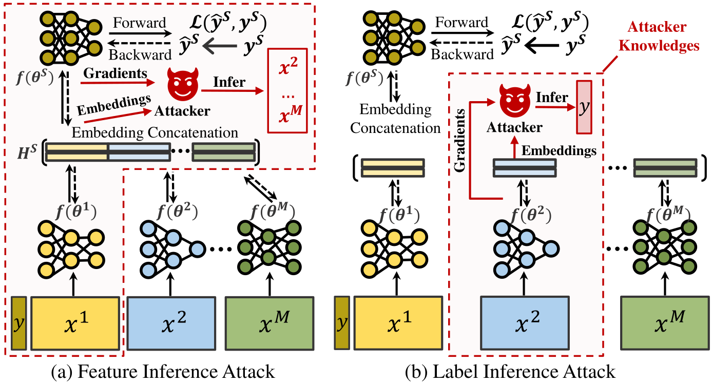

# Vertical Federated Learning for Effectiveness, Security, Applicability: A Survey
> #### [Vertical Federated Learning for Effectiveness, Security, Applicability: A Survey [Paper Link]](https://dl.acm.org/doi/10.1145/3720539)
> Mang Ye, Wei Shen, Bo Du, Eduard Snezhko, Vassili Kovalev, Pong C. Yuen
>
> Wuhan University, National Academy of Sciences of Belarus, Hong Kong Baptist University
> 
> **Abstract** Vertical Federated Learning (VFL) is a privacy-preserving distributed learning paradigm where different parties collaboratively learn models using partitioned features of shared samples, without leaking private data. Recent research has shown promising results addressing various challenges in VFL, highlighting its potential for practical applications in cross-domain collaboration. However, the corresponding research is scattered and lacks organization. To advance VFL research, this survey offers a systematic overview of recent developments. First, we provide a history and background introduction, along with a summary of the general training protocol of VFL. We then revisit the taxonomy in recent reviews and analyze limitations in-depth. For a comprehensive and structured discussion, we synthesize recent research from three fundamental perspectives: effectiveness, security and applicability. Finally, we discuss several critical future research directions in VFL, which will facilitate the developments in this field.

Survey for Vertical Federated Learning, by [MARS](https://marswhu.github.io/index.html) Group at [Wuhan University](https://www.whu.edu.cn/), led by [Prof. Mang Ye](https://marswhu.github.io/index.html).

[](./CONTRIBUTING.md)

**Table of Contents**

- [Vertical Federated Learning for Effectiveness, Security, Applicability: A Survey](#vertical-federated-learning-for-effectiveness-security-applicability-a-survey)
  - [Our Works](#our-works)
    - [Survey](#survey)
    - [Generalized Federated Learning](#generalized-federated-learning)
    - [Robust Federated Learning](#robust-federated-learning)
    - [Personalized Federated Learning](#personalized-federated-learning)
    - [Federated Graph Learning](#federated-graph-learning)
  - [Vertical Federated Learning Survey](#vertical-federated-learning-survey)
    - [Survey Outline](#survey-outline)
    - [Preliminary](#preliminary)
      - [Example of VFL](#example-of-vfl)
      - [The Training and Testing Flow](#the-training-and-testing-flow)
    - [Basic Research Directions](#basic-research-directions)
      - [:sunny:Effectiveness](#sunnyeffectiveness)
        - [*Model Design*](#model-design)
        - [*Feature \& Client Selection*](#feature--client-selection)
      - [:sunny:Security](#sunnysecurity)
        - [*Privacy Leakage*](#privacy-leakage)
        - [*Inference Attack*](#inference-attack)
        - [*Destructive Attack*](#destructive-attack)
        - [*Defense*](#defense)
      - [:sunny:Applicability](#sunnyapplicability)
        - [*Limited Data*](#limited-data)
        - [*Large Communication Burden*](#large-communication-burden)
        - [*Client Asynchrony*](#client-asynchrony)
    - [Future Directions](#future-directions)
      - [Effectiveness/Applicability and Security Trade-off](#effectivenessapplicability-and-security-trade-off)
      - [Effectiveness Facilitates Security and Applicability](#effectiveness-facilitates-security-and-applicability)
      - [Open Issues](#open-issues)
        - [*Practical Datasets*](#practical-datasets)
        - [*Robustness and Generalization*](#robustness-and-generalization)
        - [*VFL on Different Data Variants*](#vfl-on-different-data-variants)
        - [*VFL with Foundation Models*](#vfl-with-foundation-models)


## Our Works

### Survey

- [Vertical Federated Learning for Effectiveness, Applicability, Security: A Survey](github.com) *arXiv 2024* [[Code](github.com)]

- [A Federated Learning for Generalization, Robustness, Fairness: A Survey and Benchmark](https://arxiv.org/pdf/2311.06750) *TPAMI 2024* [[Code](https://github.com/WenkeHuang/MarsFL)]

- [Heterogeneous Federated Learning: State-of-the-art and Research Challenges](https://arxiv.org/pdf/2307.10616) *ACM Computing Surveys 2023* [[Code](https://github.com/marswhu/HFL_Survey)]

### Generalized Federated Learning

- **AbrFun** - [Revisiting Federated Learning with Label Skew: An Over-Confidence Perspective](https://github.com/WenkeHuang/RevisitFL) *SCIS 2024*

    We investigate the label skew of federated learning from an over-confidence perspective.

- **RUCR** - [Federated Learning with Long-Tailed Data via Representation Unification and Classifier Rectification](https://ieeexplore.ieee.org/document/10534053) *TIFS 2024* [[Code](https://github.com/liuyuxia211/RUCR)]

    We handle the long-tail problem in federated learning by representation unification and classifier rectification.

- **FedHEAL** — [Fair Federated Learning under Domain Skew with Local Consistency and Domain Diversity](https://github.com/yuhangchen0/FedHEAL) *CVPR 2024* [[Code](https://github.com/yuhangchen0/FedHEAL)]

    We investigate the fairness of federated learning under domain skew with local consistency and domain diversity.

- **FCCL+** — [Generalizable Heterogeneous Federated Cross-Correlation and Instance Similarity Learning](https://arxiv.org/pdf/2309.16286.pdf) *TPAMI 2023* [[Code](https://github.com/WenkeHuang/FCCL)]
  
    We handle mode heterogeneous federated learning from feature and logits aspects.

- **FPL** — [Rethinking Federated Learning with Domain Shift: A Prototype View](https://openaccess.thecvf.com/content/CVPR2023/papers/Huang_Rethinking_Federated_Learning_With_Domain_Shift_A_Prototype_View_CVPR_2023_paper.pdf) *CVPR 2023* [[Code](https://github.com/WenkeHuang/RethinkFL)]

    We handle federated learning with domain shift from the prototype view.

- **FCCL** — [Learn from Others and Be Yourself in Heterogeneous Federated Learning](https://openaccess.thecvf.com/content/CVPR2022/papers/Huang_Learn_From_Others_and_Be_Yourself_in_Heterogeneous_Federated_Learning_CVPR_2022_paper.pdf) *CVPR 2022* [[Code](https://github.com/WenkeHuang/FCCL)]

    We investigate heterogeneity problems and catastrophic forgetting in federated learning.

- **FSMAFL** — [Few-Shot Model Agnostic Federated Learning](https://dl.acm.org/doi/10.1145/3503161.3548764) *ACMMM 2022* [[Code](https://github.com/FangXiuwen/FSMAFL)]
- 
    We study a challenging problem, namely few-shot model agnostic federated learning.

### Robust Federated Learning

- **SDEAHFL** — [Self-Driven Entropy Aggregation for Byzantine-Robust Heterogeneous Federated Learning](https://icml.cc/virtual/2024/poster/33274) *ICML 2024* [[Code](https://icml.cc/virtual/2024/poster/33274)]

    We deal with robust heterogeneous federated learning under byzantine attack.

- **AugHFL** — [Robust Heterogeneous Federated Learning under Data Corruption](https://openaccess.thecvf.com/content/ICCV2023/papers/Fang_Robust_Heterogeneous_Federated_Learning_under_Data_Corruption_ICCV_2023_paper.pdf) *ICCV 2023* [[Code](https://github.com/FangXiuwen/AugHFL)]

    We deal with robust heterogeneous federated learning under data corruption.

- **RHFL** — [Robust Federated Learning With Noisy and Heterogeneous Clients](https://openaccess.thecvf.com/content/CVPR2022/papers/Fang_Robust_Federated_Learning_With_Noisy_and_Heterogeneous_Clients_CVPR_2022_paper.pdf) *CVPR 2022* [[Code](https://github.com/fangxiuwen/robust_fl)]

    We deal with robust federated learning with noisy and heterogeneous clients.

### Personalized Federated Learning

- **FedAS** — [FedAS: Bridging Inconsistency in Personalized Fedearated Learning](https://github.com/xiyuanyang45/FedAS) *CVPR 2024* [[Code](https://github.com/xiyuanyang45/FedAS)]

    we present a novel PFL framework with federated parameter-alignment and client-synchronization.

- **FedDPA** — [Dynamic Personalized Federated Learning with Adaptive Differential Privacy](https://openreview.net/pdf?id=RteNLuc8D9) *NeurIPS 2023* [[Code](https://github.com/xiyuanyang45/DynamicPFL)]

    we propose a novel adaptive method for personalized federated learning with differential privacy.

### Federated Graph Learning

- **FGGP** — [Federated Graph Learning under Domain Shift with Generalizable Prototypes](https://ojs.aaai.org/index.php/AAAI/article/view/29468) *AAAI 2024* [[Code](https://github.com/GuanchengWan/FGGP)]

    We deal with federated graph learning under domain shift with generalizable prototypes.

- **FGSSL** — [Federated Graph Semantic and Structural Learning](https://marswhu.github.io/publications/files/FGSSL.pdf) *IJCAI 2023* [[Code](https://github.com/WenkeHuang/FGSSL)]

    We handle federated graph learning from node-level semantic and graph-level structure.

## Vertical Federated Learning Survey

### Survey Outline


### Preliminary

#### Example of VFL


> We present a practical cross-domain collaboration with three participants: mall, video platform, and bank. The mall acts as the active client, collaborating with the video platform and the bank as passive clients. Each client holds the local features and models of the same users. The active client holds the task labels, e.g., whether buying the cigar. A global model is introduced to make the final prediction of the shared/aligned users by aggregating feature embeddings from all clients. With prediction results and labels, the gradients can be calculated for both global and local model updation. Besides, a third-party coordinator can be employed for secure communication and sample alignment.

#### The Training and Testing Flow


> (a) During training, aligned sample embeddings are sent to the active client, where gradients are calculated based on task labels. The overall objective is to optimize for collaborative prediction. These gradients are then sent back to each client for model updating. (b) During testing, predictions on aligned samples are made utilizing the trained global and local models.

### Basic Research Directions

####  :sunny:Effectiveness

##### *Model Design*


> Tree-based Model
- [Privacy preserving vertical federated learning for tree-based models](https://arxiv.org/pdf/2008.06170) *VLDB 2020*

- [Securegbm: Secure multi-party gradient boosting](https://ieeexplore.ieee.org/abstract/document/9006000) *IEEE International Conference on Big Data (Big Data) 2019*

- [Secureboost: A lossless federated learning framework](https://ieeexplore.ieee.org/abstract/document/9440789) *IEEE Intelligent Systems 2021*

- [SecureBoost+ : A High Performance Gradient Boosting Tree Framework for Large Scale Vertical Federated Learning](https://arxiv.org/pdf/2110.10927) *arXiv 2021*

- [Large-scale Secure XGB for Vertical Federated Learning](https://dl.acm.org/doi/abs/10.1145/3459637.3482361?casa_token=HtjaoM7oCT0AAAAA:Cr81kKIkq95FI3OVhkwIuYN3CEKOBo5ypo2c6rATnykZy9kBxhDRD9hIKUt96P7JVpGTEjHpK6f1-Q) *CIKM 2021*

- [Federboost: Private federated learning for gbdt](https://arxiv.org/pdf/2011.02796) *arXiv 2022*

- [Federated Forest](https://arxiv.org/pdf/1905.10053) *IEEE Transactions on Big Data 2022*

- [An efficient and robust system for vertically federated random forest](https://arxiv.org/pdf/2201.10761) *arXiv 2022*

- [Verifiable privacy-preserving scheme based on vertical federated random forest](https://ieeexplore.ieee.org/abstract/document/9461157) *IEEE Internet of Things Journal 2022*

- [Squirrel: A Scalable Secure two-party Computation Framework for Training Gradient Boosting Decision Tree](https://www.usenix.org/system/files/usenixsecurity23-lu.pdf) *USENIX Security 2023*

- [Effective and Efficient Federated Tree Learning on Hybrid Data](https://arxiv.org/pdf/2310.11865) *ICLR 2024*

> Neural Network-based Model

- [Multi-participant multi-class vertical federated learning](https://arxiv.org/pdf/2001.11154) *arXiv 2020*

- [A secure federated transfer learning framework](https://ieeexplore.ieee.org/abstract/document/9076003) *IEEE Intelligent Systems 2020*

- [Pyvertical: A vertical federated learning framework for multi-headed splitnn](https://arxiv.org/pdf/2104.00489) *ICLR 2021 Workshop*

- [Fedsl: Federated split learning on distributed sequential data in recurrent neural networks](https://arxiv.org/pdf/2011.03180) *Multimedia Tools and Applications 2024*

##### *Feature & Client Selection*


> Feature Selection

- [Vertical federated learning-based feature selection with non-overlapping sample utilization](https://www.sciencedirect.com/science/article/pii/S095741742201291X) *Expert Systems with Applications 2022*

- [Secure Feature Selection for Vertical Federated Learning in eHealth Systems](https://ieeexplore.ieee.org/abstract/document/9838917) *ICC 2022-IEEE International Conference on Communications 2022*

- [FEAST: A Communication-efficient Federated Feature Selection Framework for Relational Data](https://dl.acm.org/doi/abs/10.1145/3588961) *Proceedings of the ACM on Management of Data 2023*

- [An embedded vertical-federated feature selection algorithm based on particle swarm optimisation](https://ietresearch.onlinelibrary.wiley.com/doi/full/10.1049/cit2.12122) *CAAI Transactions on Intelligence Technology, 2023*

- [FedSDG-FS: Efficient and Secure Feature Selection for Vertical Federated Learning](https://ieeexplore.ieee.org/abstract/document/10228895) *INFOCOM 2023*

- [LESS-VFL: Communication-Efficient Feature Selection for Vertical Federated Learning](https://proceedings.mlr.press/v202/castiglia23a/castiglia23a.pdf) *ICML 2023*

> Client Selection

- [Measure Contribution of Participants in Federated Learning](https://ieeexplore.ieee.org/abstract/document/9006179) *IEEE International Conference on Big Data (Big Data) 2019*

- [VF-PS: How to Select Important Participants in Vertical Federated Learning, Efficiently and Securely?](https://proceedings.neurips.cc/paper_files/paper/2022/file/0e1a2388cd2f78069f4d048d935cb218-Paper-Conference.pdf) *NeurIPS 2022*

- [Fair and efficient contribution valuation for vertical federated learning](https://arxiv.org/pdf/2201.02658) *ICLR 2024*

#### :sunny:Security

##### *Privacy Leakage*

> Secure Alignment

- [Private federated learning on vertically partitioned data via entity resolution and additively homomorphic encryption](https://arxiv.org/pdf/1711.10677) *arXiv 2017*

- [Multi-party private set intersection in vertical federated learnin](https://ieeexplore.ieee.org/abstract/document/9343209) *TrustCom 2020*

- [Vertical federated learning without revealing intersection membership](https://arxiv.org/pdf/2106.05508) *arXiv 2021*

> Secure Embedding Transportation

- [Private federated learning on vertically partitioned data via entity resolution and additively homomorphic encryption](https://arxiv.org/pdf/1711.10677) *arXiv 2017*

- [Hybrid differentially private federated learning on vertically partitioned data](https://arxiv.org/pdf/2009.02763) *arXiv 2020*

- [Falcon: A Privacy-Preserving and Interpretable Vertical Federated Learning System](https://dl.acm.org/doi/abs/10.14778/3603581.3603588) *VLDB 2023*

> Secure Gradient Transportation

- [FedV: Privacy-Preserving Federated Learning over Vertically Partitioned Data](https://dl.acm.org/doi/pdf/10.1145/3474369.3486872) *AISec 2021*

- [Vertically Federated Learning with Correlated Differential Privacy](https://www.mdpi.com/2079-9292/11/23/3958) *Electronics 2022*

- [Adaptive differential privacy in vertical federated learning for mobility forecasting](https://www.sciencedirect.com/science/article/pii/S0167739X2300290X) *Future Generation Computer Systems 2023*

##### *Inference Attack*



> Feature Inference Attack

- [Feature inference attack on model predictions in vertical federated learning](https://ieeexplore.ieee.org/abstract/document/9458672) *ICDE 2021*

- [Cafe: Catastrophic data leakage in vertical federated learning](https://proceedings.neurips.cc/paper_files/paper/2021/file/08040837089cdf46631a10aca5258e16-Paper.pdf) *NeurIPS 2021*

- [Privacy against inference attacks in vertical federated learning](https://arxiv.org/pdf/2207.11788) *arXiv 2022*

- [Feature reconstruction attacks and countermeasures of dnn training in vertical federated learning](https://arxiv.org/pdf/2210.06771) *arXiv 2022*

- [Practical feature inference attack in vertical federated learning during prediction in artificial internet of things](https://ieeexplore.ieee.org/abstract/document/10122963) *IEEE Internet of Things Journal 2023*

> Label Inference Attack

- [Label leakage and protection in two-party split learning](https://arxiv.org/abs/2102.08504) *arXiv 2021*

- [Batch label inference and replacement attacks in black-boxed vertical federated learning](https://arxiv.org/pdf/2112.05409) *arXiv 2022*

- [Label leakage and protection from forward embedding in vertical federated learning](https://arxiv.org/pdf/2203.01451) *arXiv 2022*

- [Label inference attacks against vertical federated learning](https://www.usenix.org/system/files/sec22-fu-chong.pdf) *USENIX Security 2022*

- [Exploit: Extracting private labels in split learning](https://arxiv.org/pdf/2112.01299)

- [Your Labels are Selling You Out: Relation Leaks in Vertical Federated Learning](https://ieeexplore.ieee.org/abstract/document/9899694) *TDSC 2022*

##### *Destructive Attack*


> Backdoor Attack

- [Backdoor attacks and defenses in feature-partitioned collaborative learning](https://arxiv.org/pdf/2007.03608) *ICML Workshop 2020*

- [Graph-fraudster: Adversarial attacks on graph neural network-based vertical federated learning](https://ieeexplore.ieee.org/abstract/document/9745270/) *IEEE Transactions on Computational Social Systems 2022*

- [LR-BA: Backdoor attack against vertical federated learning using local latent representations](https://www.sciencedirect.com/science/article/pii/S0167404823001037) *Computers & Security, 2023*

- [Backdoor Attack Against Split Neural Network-Based Vertical Federated Learning](https://ieeexplore.ieee.org/abstract/document/10296882/) *TIFS 2023*

- [Villain: Backdoor Attacks Against Vertical Split Learning](https://www.usenix.org/system/files/usenixsecurity23-bai.pdf) *USENIX Security 2023*

- [Practical and general backdoor attacks against vertical federated learning](https://arxiv.org/pdf/2306.10746) *ECML PKDD 2023*

- [Universal adversarial backdoor attacks to fool vertical federated learning](https://www.sciencedirect.com/science/article/pii/S0167404823005114) *Computers & Security 2024*

> Poison Attack

- [VFedAD: A Defense Method Based on the Information Mechanism Behind the Vertical Federated Data Poisoning Attack](https://dl.acm.org/doi/abs/10.1145/3583780.3615106) *CIKM 2023*

- [Hijack Vertical Federated Learning Models As One Party](https://ieeexplore.ieee.org/abstract/document/10413626) *TDSC 2024*

- [A GAN-based data poisoning framework against anomaly detection in vertical federated learning](https://arxiv.org/pdf/2401.08984) *arXiv 2024*

- [Constructing Adversarial Examples for Vertical Federated Learning: Optimal Client Corruption through Multi-Armed Bandit](https://openreview.net/pdf?id=m52uU0dVbH) *ICLR 2024*

##### *Defense*

> Defense Against Feature Inference Attack

- [Defending against reconstruction attack in vertical federated learning](https://arxiv.org/pdf/2107.09898) *ICML Workshop 2021*

- [Secure Split Learning against Property Inference and Data Reconstruction Attacks](https://openreview.net/pdf?id=fn0FXlXkzL) *arXiv 2022*

- [FedPass: Privacy-Preserving Vertical Federated Deep Learning with Adaptive Obfuscation](https://arxiv.org/pdf/2301.12623) *IJCAI 2023*

- [Vulnerabilities of Data Protection in Vertical Federated Learning Training and Countermeasures](https://ieeexplore.ieee.org/abstract/document/10430093) *TIFS 2024*

- [Gradient-based defense methods for data leakage in vertical federated learning](https://www.sciencedirect.com/science/article/pii/S0167404824000452) *Computers & Security 2024*

> Defense Against Label Inference Attack

- [Label leakage and protection in two-party split learning](https://arxiv.org/abs/2102.08504) *arXiv 2021*

- [Rvfr: Robust vertical federated learning via feature subspace recovery](https://par.nsf.gov/servlets/purl/10332169) *NeurIPS Workshop 2021*

- [Label leakage and protection from forward embedding in vertical federated learning](https://arxiv.org/pdf/2203.01451) *arXiv 2022*

- [Defending Batch-Level Label Inference and Replacement Attacks in Vertical Federated Learning](https://ieeexplore.ieee.org/document/9833321) *IEEE Transactions on Big Data 2022*

- [Making split learning resilient to label leakage by potential energy loss](https://arxiv.org/abs/2210.09617) *arXiv 2022*

- [Differentially private label protection in split learning](https://arxiv.org/pdf/2203.02073) *arXiv 2022*

- [Eliminating Label Leakage in Tree-Based Vertical Federated Learning](https://arxiv.org/abs/2307.10318) *arXiv 2023*

- [Beyond model splitting: Preventing label inference attacks in vertical federated learning with dispersed training](https://link.springer.com/article/10.1007/s11280-023-01159-x) *World Wide Web Journal 2023*

- [FLSG: A Novel Defense Strategy Against Inference Attacks in Vertical Federated Learning](https://ieeexplore.ieee.org/abstract/document/10210670) *IEEE Internet of Things Journal 2024*

- [ProjPert: Projection-based Perturbation for Label Protection in Split Learning based Vertical Federated Learning](https://www.computer.org/csdl/journal/tk/5555/01/10380676/1TrdkU6LMIM) *TKDE 2024*

- [HashVFL: Defending Against Data Reconstruction Attacks in Vertical Federated Learning](https://ieeexplore.ieee.org/abstract/document/10409241/) *TIFS 2024*

- [Vulnerabilities of Data Protection in Vertical Federated Learning Training and Countermeasures](https://ieeexplore.ieee.org/abstract/document/10430093/) *TIFS 2024*

> Defense Against Destructive Attack

- [Rvfr: Robust vertical federated learning via feature subspace recovery](https://par.nsf.gov/servlets/purl/10332169) *NeurIPS Workshop 2021*

- [Backdoor Attack Against Split Neural Network-Based Vertical Federated Learning](https://ieeexplore.ieee.org/abstract/document/10296882) *TIFS 2023*

- [VFedAD: A Defense Method Based on the Information Mechanism Behind the Vertical Federated Data Poisoning Attack](https://dl.acm.org/doi/abs/10.1145/3583780.3615106) *CIKM 2023*

- [A GAN-based data poisoning framework against anomaly detection in vertical federated learning](https://arxiv.org/pdf/2401.08984) *arXiv 2024*

- [Hijack Vertical Federated Learning Models As One Party](https://ieeexplore.ieee.org/abstract/document/10413626) *TDSC 2024*

#### :sunny:Applicability

##### *Limited Data*


> Limited Aligned Samples

- [FedCVT: Semi-supervised Vertical Federated Learning with Cross-view Training](https://dl.acm.org/doi/full/10.1145/3510031) *TIST 2022*

- [Multi-View Federated Learning with Data Collaboration](https://dl.acm.org/doi/abs/10.1145/3529836.3529904) *ICMLC 2022*

- [Communication-Efficient Vertical Federated Learning with Limited Overlapping Samples](https://openaccess.thecvf.com/content/ICCV2023/papers/Sun_Communication-Efficient_Vertical_Federated_Learning_with_Limited_Overlapping_Samples_ICCV_2023_paper.pdf) *ICCV 2023*

> Limited Labels

- [Implementing Vertical Federated Learning Using Autoencoders: Practical Application, Generalizability, and Utility Study](https://medinform.jmir.org/2021/6/e26598/) *JMIR Medical Informatics 2021*

- [Practical Vertical Federated Learning with Unsupervised Representation Learning](https://ieeexplore.ieee.org/abstract/document/9789268) *IEEE Transactions on Big Data 2022*

- [Self-supervised vertical federated learning](https://openreview.net/pdf?id=z2RNsvYZZTf) *NeurIPS Workshop 2022*

- [A hybrid self-supervised learning framework for vertical federated learning](https://arxiv.org/pdf/2208.08934) *arxiv 2023*

##### *Large Communication Burden*


- [Federated doubly stochastic kernel learning for vertically partitioned data](https://dl.acm.org/doi/abs/10.1145/3394486.3403298) *KDD 2020*

- [AsySQN: Faster Vertical Federated Learning Algorithms with Better Computation Resource Utilization](https://dl.acm.org/doi/abs/10.1145/3447548.3467169) *KDD 2021*

- [Communication-Efficient Vertical Federated Learning](https://www.mdpi.com/1999-4893/15/8/273) *Algorithms 2022*

- [FedBCD: A communication-efficient collaborative learning framework for distributed features](https://ieeexplore.ieee.org/abstract/document/9855231) *IEEE Transactions on Signal Processing 2022*

- [Compressed-VFL: Communication-Efficient Learning with Vertically Partitioned Data](https://proceedings.mlr.press/v162/castiglia22a/castiglia22a.pdf) *ICML 2022*

- [Towards Communication-efficient Vertical Federated Learning Training via Cache-enabled Local Updates](https://arxiv.org/pdf/2207.14628) *VLDB 2022*

- [Cheetah: Lean and fast secure two-party deep neural network inference](https://www.usenix.org/system/files/sec22-huang-zhicong.pdf) *USENIX Security 2022*

- [SparseVFL: Communication-Efficient Vertical Federated Learning Based on Sparsification of Embeddings and Gradients](https://openreview.net/pdf?id=BVH3-XCRoN3) *KDD FL4Data-Mining 2023*

- [A Unified Solution for Privacy and Communication Efficiency in Vertical Federated Learning](https://proceedings.neurips.cc/paper_files/paper/2023/file/2b5af479527167d4af78847a9b9b645f-Paper-Conference.pdf) *NeurIPS 2023*

##### *Client Asynchrony*

- [VAFL: a Method of Vertical Asynchronous Federated Learning](https://arxiv.org/pdf/2007.06081) *ICML Workshop 2020*

- [Efficient Asynchronous Vertical Federated Learning via Gradient Prediction and Double-End Sparse Compression](https://ieeexplore.ieee.org/abstract/document/9305383) *ICARCV 2020*

- [Secure Bilevel Asynchronous Vertical Federated Learning with Backward Updating](https://ojs.aaai.org/index.php/AAAI/article/view/17301) *AAAI 2021*

- [Privacy-Preserving Asynchronous Vertical Federated Learning Algorithms for Multiparty Collaborative Learning](https://ieeexplore.ieee.org/abstract/document/9463409) *TNNLS 2022*

- [Efficient Asynchronous Multi-Participant Vertical Federated Learning](https://ieeexplore.ieee.org/document/9866779) *IEEE Transactions on Big Data 2022*

- [vfedsec: Efficient secure aggregation for vertical federated learning via secure layer](https://arxiv.org/pdf/2305.16794) *arXiv 2023*

- [Robust and ip-protecting vertical federated learning against unexpected quitting of parties](https://arxiv.org/pdf/2303.18178) *arXiv 2023*

- [Fedvs: Straggler-resilient and privacy-preserving vertical federated learning for split models](https://proceedings.mlr.press/v202/li23an/li23an.pdf) *ICML 2023*

### Future Directions

#### Effectiveness/Applicability and Security Trade-off

- [A framework for evaluating privacy-utility trade-off in vertical federated learning](https://arxiv.org/pdf/2209.03885) *arXiv 2022*

- [Privacy Tradeoffs in Vertical Federated Learning](https://openreview.net/pdf?id=wLoavINXabQ) *Federated Learning Systems (FLSys) Workshop 2023*

#### Effectiveness Facilitates Security and Applicability

> No recent works and will be a critical direction in the future.

#### Open Issues

##### *Practical Datasets*

- [A coupled design of exploiting record similarity for practical vertical federated learning](https://proceedings.neurips.cc/paper_files/paper/2022/file/84b744165a0597360caad96b06e69313-Paper-Conference.pdf) *NeurIPS 2022*

- [VFLAIR: A Research Library and Benchmark for Vertical Federated Learning](https://arxiv.org/pdf/2310.09827) *ICLR 2024*

- [Vertibench: Advancing feature distribution diversity in vertical federated learning benchmarks](https://arxiv.org/pdf/2307.02040) *ICLR 2024*

##### *Robustness and Generalization*

> Generalization to Unfair Prediction Bias

- [Achieving model fairness in vertical federated learning](https://arxiv.org/pdf/2109.08344) *arXiv 2021*

- [Fairvfl: A fair vertical federated learning framework with contrastive adversarial learning](https://proceedings.neurips.cc/paper_files/paper/2022/file/333a7697dbb67f09249337f81c27d749-Paper-Conference.pdf) *NeurIPS 2022*

##### *VFL on Different Data Variants*

> Multi-Modal Data

- [A Multi-Modal Vertical Federated Learning Framework Based on Homomorphic Encryption](https://ieeexplore.ieee.org/abstract/document/10348546) *TIFS 2023*

> Graph Data

- [Fedsgc: Federated simple graph convolution for node classification](https://federated-learning.org/fl-ijcai-2021/FTL-IJCAI21_paper_5.pdf) *IJCAI Workshop 2021*

- [A vertical federated learning framework for graph convolutional network](https://arxiv.org/pdf/2106.11593) *arXiv 2021*

- [Vertically federated graph neural network for privacy-preserving node classification](https://www.ijcai.org/proceedings/2022/0272.pdf) *IJCAI 2022*

- [Graph-fraudster: Adversarial attacks on graph neural network-based vertical federated learning](https://ieeexplore.ieee.org/abstract/document/9745270) *IEEE Transactions on Computational Social Systems 2023*

- [Glasu: A communication-efficient algorithm for federated learning with vertically distributed graph data](https://arxiv.org/pdf/2303.09531) *arXiv 2023*

- [Vertical federated graph neural network for recommender system](https://proceedings.mlr.press/v202/mai23b/mai23b.pdf) *ICML 2023*

- [Privacy-preserving design of graph neural networks with applications to vertical federated learning](https://arxiv.org/pdf/2310.20552) *NeurIPS Workshop 2023*

##### *VFL with Foundation Models*

- [Input Reconstruction Attack against Vertical Federated Large Language Models](https://arxiv.org/pdf/2311.07585) *arXiv 2023*


Please kindly cite the paper if it helps your research, thanks!

```
@article{ye2025vertical,
  title={Vertical Federated Learning for Effectiveness, Security, Applicability: A Survey},
  author={Ye, Mang and Shen, Wei and Du, Bo and Snezhko, Eduard and Kovalev, Vassili and Yuen, Pong C},
  journal={ACM Computing Surveys},
  year={2025}
}
@inproceedings{shen2025label,
  title={Label-free backdoor attacks in vertical federated learning},
  author={Shen, Wei and Huang, Wenke and Wan, Guancheng and Ye, Mang},
  booktitle={The 39th AAAI Conference on Artificial Intelligence},
  year={2025}
}
@article{shen2025limitedvfl,
  title={Build Yourself Before Collaboration: Vertical Federated Learning with Limited Aligned Samples},
  author={Shen, Wei and Ye, Mang and Yu, Wei and Yuen, Pong C.},
  journal={IEEE Transactions on Mobile Computing},
  year={2025}
}
```

